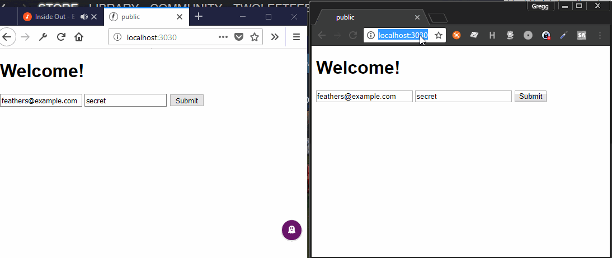

# donejs cookie bug

Steps to reproduce:

1. npm install in both root and `public` folders
2. Patch the following issues in manually:

This issue prevents donessr from **ever** sending an authentication request: 
can-connect-feathers won't authenticate in donejs - https://github.com/canjs/can-connect-feathers/issues/111
    remove the check for !doneSSR

This issue prevents done-ssr from ever providing a valid response object for feathers, so the response "errors" out:
response.ok should be set - https://github.com/donejs/done-ssr/issues/509
    make sure response.ok = resp.ok

3. Start the server: 
```
node src/index
```

4. Open two windows, one in incognito at localhost:3030
5. Login with one using the default
6. Login with the other one using `other@example.com` (same password)
7. Refresh the "other" user's page

